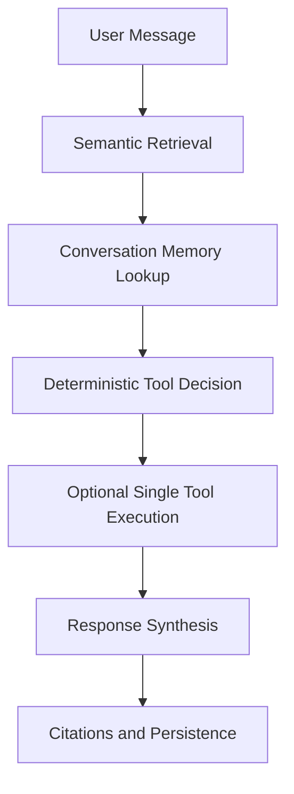

# chatbot-devops

Production-ready FastAPI backend for a local AI DevOps assistant with PostgreSQL, pgvector, SQLAlchemy, Ollama, structured logging, modular tools, streaming chat responses, and document ingestion for retrieval augmented generation.

## Architecture

- `app/api/` HTTP endpoints and dependency wiring
- `app/services/` chat, LLM, Jenkins, and health services
- `app/services/orchestration_service.py` lightweight retrieval-first orchestration
- `app/rag/` chunking, ingestion, and retrieval logic
- `app/db/` SQLAlchemy models and async session management
- `app/models/` API and LLM data models
- `app/tools/` tool registry and executable tools
- `app/core/` configuration, logging, and service container
- `alembic/` database migrations

## Stack

- FastAPI
- PostgreSQL
- pgvector
- SQLAlchemy async
- Ollama with `llama3.1:8b`
- `nomic-embed-text` embeddings
- OpenAI-compatible provider abstraction
- LangChain text splitters
- Async tool execution framework with validation, retry, timeout, and tracing
- Lightweight orchestration layer for retrieval, optional tool use, memory, and synthesis
- Docker Compose
- Streamlit frontend

## Quick Start

1. Copy the environment file.
2. Start PostgreSQL with pgvector, Ollama, the FastAPI backend, and Streamlit.
3. Optionally enable PgAdmin or Redis profiles.
4. Ingest documents from the API or CLI.
5. Chat against the local knowledge base.

### Docker Compose

```bash
cp .env.example .env
docker compose up --build
```

The default stack includes:

- `postgres` using the `pgvector/pgvector:pg16` image for vector retrieval
- `ollama` for local LLM inference
- `ollama-init` to pre-pull the configured chat and embedding models
- `backend` running FastAPI with Alembic migrations on startup
- `streamlit` for the local frontend

Enable optional services only when you need them:

```bash
docker compose --profile admin --profile cache up --build
```

The `admin` profile enables PgAdmin. The `cache` profile enables Redis.

### Local Python Run

Requires Python 3.12 and a running PostgreSQL + Ollama instance.

```bash
python3.12 -m venv .venv
source .venv/bin/activate
pip install -r requirements.txt
cp .env.example .env
export PYTHONPATH=$PWD
alembic upgrade head
uvicorn app.main:app --host 0.0.0.0 --port 8000 --reload
```

### Streamlit UI

Run the UI in a separate terminal after the FastAPI API is up:

```bash
source .venv/bin/activate
streamlit run streamlit_app.py
```

With Docker Compose, the Streamlit UI is already included and available at `http://localhost:8501`.

## Endpoints

### Health

```bash
curl http://localhost:8000/health
```

### Ingest Documents

```bash
curl -X POST http://localhost:8000/ingest \
  -H 'Content-Type: application/json' \
  -d '{
    "filesystem_sources": [
      {
        "source_key": "repo-assets",
        "root_path": "./assets",
        "glob_pattern": "**/*",
        "source_type": "filesystem",
        "metadata": {"team": "devops"}
      }
    ],
    "incremental": true
  }'
```

### Ingest Direct Documents

```bash
curl -X POST http://localhost:8000/ingest \
  -H 'Content-Type: application/json' \
  -d '{
    "documents": [
      {
        "source_id": "jenkins-guide",
        "source_key": "manual-seed",
        "title": "Jenkins Guide",
        "text": "Jenkins pipelines are defined in Jenkinsfiles.",
        "metadata": {"category": "ci"}
      }
    ]
  }'
```

### Chat

```bash
curl -X POST http://localhost:8000/chat \
  -H 'Content-Type: application/json' \
  -d '{"message":"How do Jenkins pipelines work?"}'
```

The chat flow is intentionally simple and maintainable:



The Streamlit UI consumes the same FastAPI endpoints and adds:

- chat interface with streaming responses
- conversation history sidebar backed by persisted conversations
- KB source panel and uploaded document list
- memory visualization panel
- tool execution indicators from orchestration metadata

## Compose Environment

### Services

- `postgres`: PostgreSQL with pgvector extension support and a persistent data volume.
- `backend`: FastAPI API with restart policy, health check, env-driven config, and source bind mount for local development.
- `ollama`: local model inference runtime with persistent model volume.
- `streamlit`: modern UI connected to the backend through `STREAMLIT_API_BASE_URL`.
- `pgadmin` optional: database admin UI behind the `admin` profile.
- `redis` optional: local cache service behind the `cache` profile.

### Startup Instructions

1. Copy the env template:

```bash
cp .env.example .env
```

2. Build and start the default stack:

```bash
docker compose up --build
```

3. Open the services:

- FastAPI: `http://localhost:8000`
- Streamlit: `http://localhost:8501`
- Ollama API: `http://localhost:11434`

4. Optional admin services:

```bash
docker compose --profile admin --profile cache up --build
```

- PgAdmin: `http://localhost:5050`
- Redis: `localhost:6379`

### Troubleshooting Notes

- If `backend` stays unhealthy, inspect `docker compose logs backend` and verify `DATABASE_URL` and `LLM_API_BASE_URL` match the Compose service names.
- If `streamlit` loads but chat fails, confirm `STREAMLIT_API_BASE_URL=http://backend:8000` inside Compose and `http://localhost:8000` when running Streamlit locally outside Docker.
- If Ollama startup is slow, wait for `ollama-init` to finish pulling `LLM_CHAT_MODEL` and `LLM_EMBEDDING_MODEL`.
- If PostgreSQL fails health checks, remove the stale volume only if you intentionally want a clean reset: `docker compose down -v`.
- If you enable PgAdmin, use the `POSTGRES_*` values from `.env` when registering the server in the PgAdmin UI.

### Streaming Chat

```bash
curl -N -X POST http://localhost:8000/chat \
  -H 'Content-Type: application/json' \
  -d '{"message":"Summarize the ingested Jenkins guide.","stream":true}'
```

### Tools

```bash
curl http://localhost:8000/tools
```

```bash
curl http://localhost:8000/tools/jenkins
```

```bash
curl -X POST http://localhost:8000/tools/execute \
  -H 'Content-Type: application/json' \
  -d '{"name":"semantic_search","arguments":{"query":"jenkins pipelines","limit":3}}'
```

```bash
curl -X POST http://localhost:8000/tools/execute \
  -H 'Content-Type: application/json' \
  -d '{"name":"jenkins","arguments":{"action":"list_jobs"}}'
```

```bash
curl -X POST http://localhost:8000/tools/execute \
  -H 'Content-Type: application/json' \
  -d '{
    "name":"jenkins",
    "arguments":{
      "action":"create_job",
      "name":"demo-job",
      "config_xml":"<project><actions/></project>"
    }
  }'
```

If you configure allowlisted API integrations, the generic API tool can call them safely:

```bash
export TOOL_API_INTEGRATIONS_JSON='{
  "jsonplaceholder": {
    "base_url": "https://jsonplaceholder.typicode.com",
    "allowed_methods": ["GET"],
    "allowed_paths": ["/posts", "/users"]
  }
}'
```

```bash
curl -X POST http://localhost:8000/tools/execute \
  -H 'Content-Type: application/json' \
  -d '{
    "name":"api",
    "arguments":{
      "integration":"jsonplaceholder",
      "method":"GET",
      "path":"/posts",
      "query":{"_limit":2}
    }
  }'
```

## Notes

- Conversation memory is stored in PostgreSQL in `conversations` and `conversation_messages`.
- Document chunks and embeddings are stored in `document_chunks` using pgvector.
- The OpenAI-compatible provider is configured through `LLM_API_BASE_URL`, so switching away from Ollama is an environment change rather than an application rewrite.
- Tool execution responses are standardized with `status`, `data` or `error`, and a trace block containing `trace_id`, attempts, timeout, and duration.
- `app/tools/` now contains a reusable modular tool framework with `ToolRegistry`, `ToolExecutionService`, `JenkinsTool`, `ApiTool`, and typed tool interfaces.
- The API tool is safe by default: it only uses named integrations from `TOOL_API_INTEGRATIONS_JSON`, only allows relative paths, and enforces allowlisted methods and path prefixes.
- The orchestration layer is retrieval-first and only executes at most one tool per user turn. There are no autonomous loops, recursive agents, or background agent swarms.
- Memory awareness comes from recent conversation history plus semantically ranked `memory_entries` persisted from earlier user turns.

## Lightweight Orchestration

Architecture:

- `RetrieverService`: fetches top semantic context blocks and citations first.
- `MemoryService`: retrieves recent conversation history and relevant episodic memories.
- `OrchestrationService`: decides whether a tool is needed, executes at most one safe tool, and builds the final prompt.
- `ChatService`: thin facade used by FastAPI routes.

Service flow:

1. Create or load the conversation.
2. Retrieve semantic context.
3. Retrieve recent messages and relevant memory entries.
4. Use deterministic heuristics to decide whether a Jenkins or API tool is needed.
5. Execute at most one tool through `ToolExecutionService`.
6. Synthesize the final response from retrieval, memory, and optional tool output.
7. Persist the user turn, assistant turn, and episodic memory.

Example orchestration metadata is returned on chat responses:

```json
{
  "trace_id": "...",
  "retrieval_count": 4,
  "memory_count": 2,
  "tool_invocation": {
    "name": "jenkins",
    "status": "success",
    "trace_id": "..."
  }
}
```

## CLI Ingestion

```bash
source .venv/bin/activate
export PYTHONPATH=$PWD
python scripts/ingest_documents.py ./assets --source-key repo-assets --glob '**/*'
```

Run a full refresh instead of incremental ingestion:

```bash
python scripts/ingest_documents.py ./assets --source-key repo-assets --glob '**/*' --full-refresh
```

## Recommended Chunking Strategy

- Markdown: split on headings first, then recursively chunk with overlap to preserve section structure and citation quality.
- Text: recursively split on paragraphs, then sentences, before hard character cuts.
- YAML: normalize parsed YAML back to text, carry top-level keys into metadata, then recursively split.
- PDF: extract page text and preserve page count metadata; expect noisier chunks than markdown and text.
- Default chunk size: `1200` characters with `150` overlap is a good local-first starting point for `nomic-embed-text` at `768` dimensions.
- Incremental ingestion: skip unchanged documents by comparing stored `content_sha256` with the latest parsed checksum.