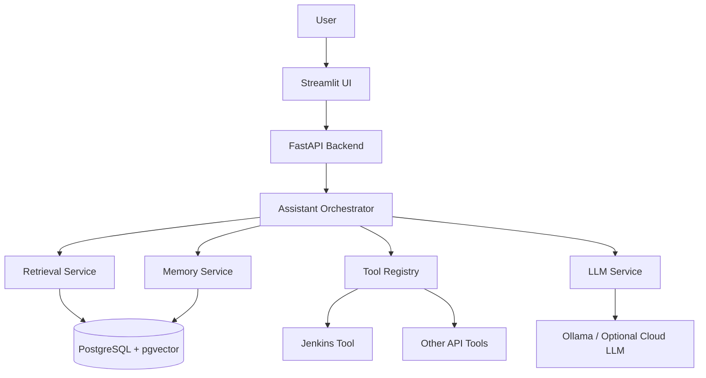
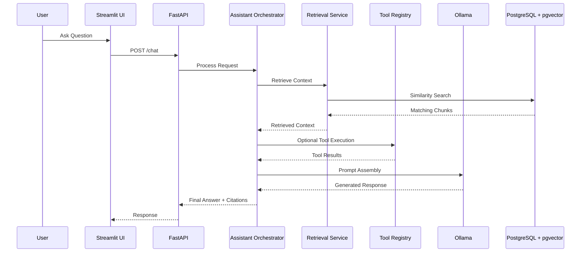
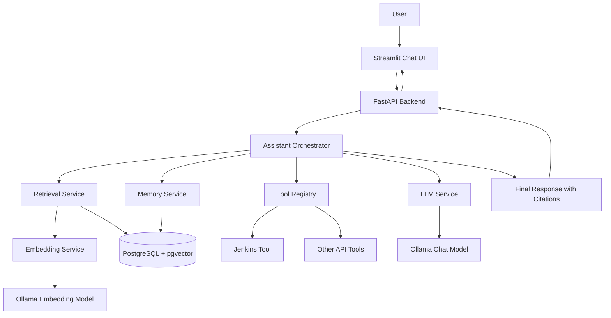
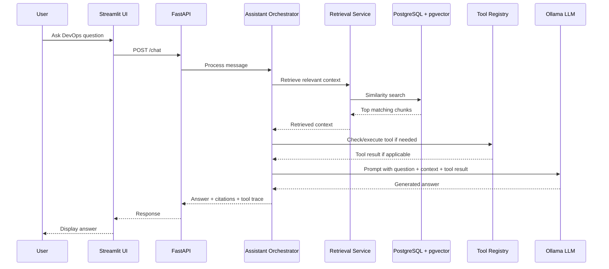
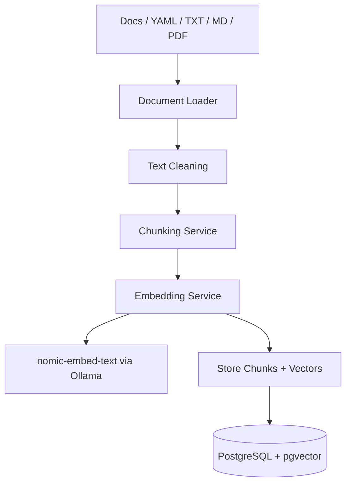
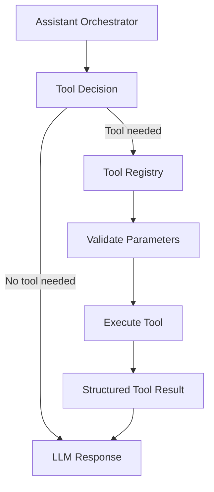
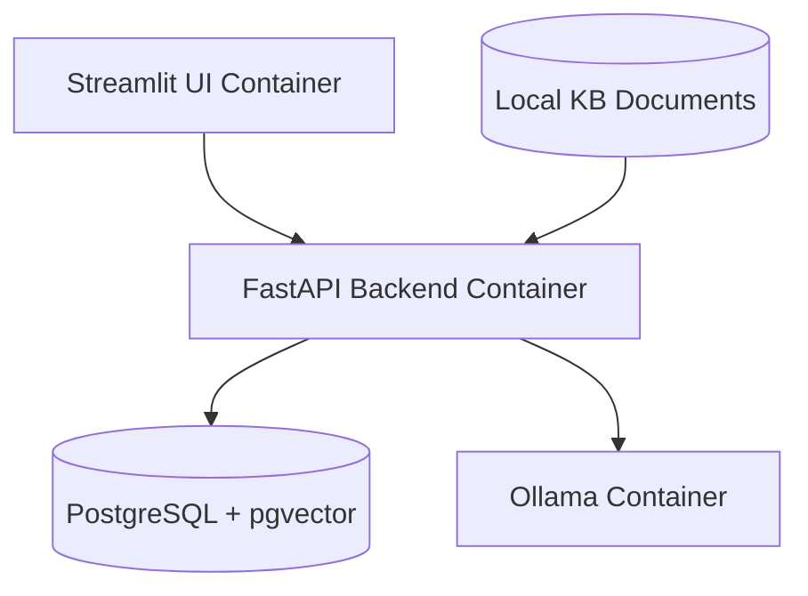
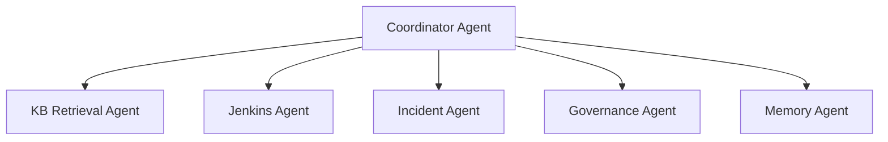

# Architecture Design Document

# Legacy DevOps Chatbot Migration to Local KB + pgvector + Lightweight Agents

## 1. Document Purpose

This document defines the target architecture for migrating the legacy Rasa-based DevOps chatbot into a modern local-first AI assistant platform.

The new platform will remove Rasa and replace it with:

- FastAPI backend
- PostgreSQL with pgvector
- Local knowledge base ingestion
- Retrieval-Augmented Generation (RAG)
- Ollama/local LLM support
- Modular tool execution
- Lightweight agent orchestration
- Streamlit UI for MVP demo

The goal is to create a practical POC/MVP that can answer DevOps questions from a local knowledge base and optionally execute approved tools such as Jenkins-related operations.

---

## 2. Current State Architecture

The legacy project is based on Rasa.

```text
User
  ↓
Rasa Chatbot
  ↓
NLU / Intent Classification
  ↓
Stories / Rules
  ↓
Custom Actions
  ↓
Jenkins APIs / Static Responses / DevOps Logic
```

### Current Components

| Component | Description | Migration Decision |
|---|---|---|
| Rasa NLU | Intent classification | Remove |
| Rasa Stories | Conversation paths | Remove |
| Rasa Rules | Rule-based flow | Remove |
| Domain YAML | Rasa configuration | Remove |
| Custom Actions | Python business logic | Refactor |
| Jenkins Logic | DevOps integration | Keep and refactor |
| Training Data | Example phrases/intents | Convert to KB seed data |
| Docker Assets | Container setup | Reuse as reference |

---

## 3. Target Architecture Overview

The new system will use a retrieval-first architecture.



### Target Runtime Flow



---

## 4. High-Level Architecture Diagram



---

## 5. Architecture Principles

### 5.1 Drop Rasa Completely

Rasa should not remain in the new architecture.

The system will not use:

- intents
- stories
- rules
- domain.yml
- Rasa SDK
- Rasa action server

### 5.2 Retrieval First

The assistant should first retrieve relevant context from the local knowledge base before generating answers.

### 5.3 Tools Are Explicit and Controlled

Tools such as Jenkins APIs should be exposed through a controlled registry.

The assistant should not execute arbitrary code or shell commands.

### 5.4 Local-First AI

The MVP should run locally using:

- Ollama for chat model
- Ollama for embedding model
- PostgreSQL + pgvector for vector storage
- Docker Compose for repeatable setup

### 5.5 Agentic, But Not Overengineered

The first version should use lightweight orchestration, not a complex multi-agent swarm.

The MVP pattern should be:

```text
Retrieve → Decide Tool Need → Execute Tool if Needed → Synthesize Answer
```

---

## 6. Logical Component Architecture

## 6.1 Streamlit UI

The UI provides a simple web-based chat interface for the MVP.

Responsibilities:

- Accept user questions
- Display assistant responses
- Show source citations
- Show tool execution status
- Display conversation history
- Provide basic document ingestion/upload controls later

Why Streamlit:

- very fast MVP
- minimal frontend code
- good enough for internal demo
- easy Python integration

---

## 6.2 FastAPI Backend

FastAPI is the main backend API layer.

Responsibilities:

- expose chat endpoint
- expose ingestion endpoint
- expose health endpoint
- expose tool metadata endpoint
- coordinate services
- return structured assistant responses

Key endpoints:

```text
GET  /health
POST /chat
POST /ingest
GET  /tools
POST /tools/execute
```

---

## 6.3 Assistant Orchestrator

The orchestrator is the main brain of the assistant.

Responsibilities:

- receive user message
- retrieve relevant KB chunks
- decide whether a tool is needed
- execute approved tool if required
- combine retrieved context and tool result
- call LLM for final response
- return answer with citations

Initial implementation should be custom and simple.

Future versions may use LangGraph if orchestration becomes complex.

---

## 6.4 Retrieval Service

The retrieval service searches the local knowledge base.

Responsibilities:

- embed user query
- perform pgvector similarity search
- retrieve top matching chunks
- return chunk text, source, and metadata

Retrieval flow:

```text
User Question
  ↓
Embedding Service
  ↓
Vector Similarity Search
  ↓
Top K Relevant Chunks
  ↓
Context for LLM
```

---

## 6.5 Embedding Service

The embedding service generates vector embeddings for:

- user questions
- KB document chunks

Recommended MVP model:

```text
nomic-embed-text
```

Default embedding dimension:

```text
768
```

---

## 6.6 PostgreSQL + pgvector

PostgreSQL stores:

- document chunks
- vector embeddings
- metadata
- conversations
- memory summaries
- tool execution logs

pgvector enables semantic search.

---

## 6.7 LLM Service

The LLM service abstracts the model provider.

MVP provider:

```text
Ollama
```

Default chat model:

```text
llama3.1:8b
```

Optional future providers:

- OpenAI
- Azure OpenAI
- Claude
- local OpenAI-compatible model servers

---

## 6.8 Tool Registry

The tool registry exposes approved capabilities to the assistant.

Example tools:

- JenkinsTool
- BuildStatusTool
- DeploymentStatusTool
- IncidentLookupTool
- ApiTool

Tool responsibilities:

- validate parameters
- execute approved operations
- return structured results
- log execution status
- prevent unsafe calls

---

## 6.9 Jenkins Tool

The legacy Jenkins logic should be refactored into a standalone service/tool.

Possible operations:

```text
get_failed_jobs
get_job_status
get_build_logs
trigger_build_optional_later
```

For the MVP, start with read-only operations.

Avoid write/destructive operations until governance is added.

---

## 6.10 Memory Service

Memory should be simple in the MVP.

Memory types:

| Memory Type | Purpose | MVP? |
|---|---|---|
| Session Memory | Current chat context | Yes |
| Conversation History | Stored user/assistant messages | Yes |
| Episodic Summary | Summarized past conversations | Later |
| Semantic Memory | Long-term learned facts | Later |

---

## 7. Runtime Chat Flow



---

## 8. Document Ingestion Flow



Supported initial sources:

- Markdown
- TXT
- YAML
- PDF
- Existing Rasa NLU examples
- Existing Rasa stories/rules as historical reference
- Jenkins notes/runbooks

---

## 9. Data Architecture

## 9.1 Main Tables

### kb_documents

Stores source document metadata.

```sql
CREATE TABLE kb_documents (
    id UUID PRIMARY KEY,
    source_name TEXT NOT NULL,
    source_type TEXT NOT NULL,
    source_path TEXT,
    metadata JSONB,
    created_at TIMESTAMP DEFAULT NOW(),
    updated_at TIMESTAMP DEFAULT NOW()
);
```

### kb_chunks

Stores text chunks and vector embeddings.

```sql
CREATE TABLE kb_chunks (
    id UUID PRIMARY KEY,
    document_id UUID REFERENCES kb_documents(id),
    chunk_index INT NOT NULL,
    chunk_text TEXT NOT NULL,
    embedding VECTOR(768),
    metadata JSONB,
    created_at TIMESTAMP DEFAULT NOW()
);
```

### conversations

```sql
CREATE TABLE conversations (
    id UUID PRIMARY KEY,
    title TEXT,
    created_at TIMESTAMP DEFAULT NOW(),
    updated_at TIMESTAMP DEFAULT NOW()
);
```

### messages

```sql
CREATE TABLE messages (
    id UUID PRIMARY KEY,
    conversation_id UUID REFERENCES conversations(id),
    role TEXT NOT NULL,
    content TEXT NOT NULL,
    metadata JSONB,
    created_at TIMESTAMP DEFAULT NOW()
);
```

### tool_executions

```sql
CREATE TABLE tool_executions (
    id UUID PRIMARY KEY,
    conversation_id UUID REFERENCES conversations(id),
    tool_name TEXT NOT NULL,
    input JSONB,
    output JSONB,
    status TEXT,
    error TEXT,
    created_at TIMESTAMP DEFAULT NOW()
);
```

---

## 10. Tool Execution Architecture



Recommended tool interface:

```python
class BaseTool:
    name: str
    description: str

    async def execute(self, params: dict) -> dict:
        raise NotImplementedError
```

---

## 11. Security and Safety Design

For MVP:

- keep tools read-only first
- no arbitrary shell execution
- no direct file deletion
- no unrestricted HTTP calls
- validate all tool parameters
- log tool usage
- require explicit allowlist for tools

For future:

- authentication
- role-based access control
- approval workflow for write actions
- audit trail
- signed tool execution policies

---

## 12. Deployment Architecture

## 12.1 Local MVP Deployment



Deployment model:

```text
Docker Compose
  ├── postgres + pgvector
  ├── backend FastAPI
  ├── ollama
  └── streamlit UI
```

## 12.2 Docker Services

| Service | Purpose |
|---|---|
| postgres | relational DB + vector DB |
| backend | FastAPI AI backend |
| ollama | local model runtime |
| streamlit | chat UI |
| pgadmin | optional DB UI |

---

## 13. Target Folder Structure

```text
chatbot-next/
│
├── backend/
│   ├── app/
│   │   ├── api/
│   │   │   ├── chat.py
│   │   │   ├── ingest.py
│   │   │   ├── health.py
│   │   │   └── tools.py
│   │   │
│   │   ├── core/
│   │   │   ├── config.py
│   │   │   └── logging.py
│   │   │
│   │   ├── db/
│   │   │   ├── session.py
│   │   │   └── models.py
│   │   │
│   │   ├── rag/
│   │   │   ├── embeddings.py
│   │   │   ├── retriever.py
│   │   │   ├── ingestion.py
│   │   │   └── chunking.py
│   │   │
│   │   ├── services/
│   │   │   ├── orchestrator.py
│   │   │   ├── llm_service.py
│   │   │   └── memory_service.py
│   │   │
│   │   ├── tools/
│   │   │   ├── base.py
│   │   │   ├── registry.py
│   │   │   └── jenkins_tool.py
│   │   │
│   │   ├── prompts/
│   │   │   └── assistant_prompt.py
│   │   │
│   │   └── main.py
│   │
│   ├── migrations/
│   ├── requirements.txt
│   └── Dockerfile
│
├── ui/
│   ├── app.py
│   └── requirements.txt
│
├── kb/
│   ├── docs/
│   ├── rasa-seed/
│   └── runbooks/
│
├── scripts/
│   └── ingest.py
│
├── docker-compose.yml
├── .env.example
└── README.md
```

---

## 14. Migration Strategy and Roadmap

## Phase 0 — Architecture and Repository Review

Goals:

- inspect legacy repository
- identify reusable logic
- identify technical debt
- identify hardcoded configurations
- identify Jenkins/API integrations
- map Rasa dependencies

Deliverables:

```text
architecture-design.md
legacy-inventory.md
migration-roadmap.md
```

Success Criteria:

```text
Clear understanding of what to keep, refactor, and remove
```

---

## Phase 1 — Backend Foundation

Goals:

- create FastAPI backend skeleton
- establish clean architecture
- configure logging
- add health endpoint
- create Docker setup
- add environment management

Deliverables:

```text
backend service starts successfully
```

Success Criteria:

```text
GET /health returns healthy status
```

---

## Phase 2 — PostgreSQL + pgvector

Goals:

- configure PostgreSQL
- enable pgvector
- create schemas
- implement vector similarity search
- add SQLAlchemy models
- add migrations

Deliverables:

```text
vector search operational
```

Success Criteria:

```text
Can store and retrieve embedded chunks
```

---

## Phase 3 — Document Ingestion Pipeline

Goals:

- add markdown ingestion
- add txt ingestion
- add yaml ingestion
- add PDF ingestion
- implement chunking
- implement embeddings
- add metadata tracking

Deliverables:

```text
kb ingestion pipeline operational
```

Success Criteria:

```text
Documents searchable via semantic retrieval
```

---

## Phase 4 — Local RAG Chat

Goals:

- add retrieval pipeline
- add prompt assembly
- integrate Ollama
- add citations
- add conversation persistence

Deliverables:

```text
local KB chatbot operational
```

Success Criteria:

```text
Assistant answers using retrieved local knowledge
```

---

## Phase 5 — Tool Execution Layer

Goals:

- refactor Jenkins actions
- create BaseTool abstraction
- implement ToolRegistry
- add safe tool execution
- add tool logging
- add tool metadata

Deliverables:

```text
read-only Jenkins tool support
```

Success Criteria:

```text
Assistant can retrieve live Jenkins information
```

---

## Phase 6 — Streamlit MVP UI

Goals:

- create chat interface
- add conversation history
- add citations display
- add tool execution indicators
- improve usability

Deliverables:

```text
usable internal demo UI
```

Success Criteria:

```text
End-to-end local assistant demo works
```

---

## Phase 7 — Governance and Observability

Goals:

- add structured logs
- add audit trail
- add execution traces
- add tool restrictions
- add basic governance controls

Deliverables:

```text
observable and safer runtime
```

Success Criteria:

```text
Tool executions and retrieval flows traceable
```

---

## Phase 8 — Future Agent Evolution

Goals:

- optional LangGraph integration
- specialized agents
- incident summarization
- Delivery Wizard DIF integration
- approval workflows
- RBAC

Potential Future Architecture:



Success Criteria:

```text
Scalable enterprise-ready orchestration
```

---

## MVP Timeline Recommendation

| Phase | Focus | Estimated Effort |
|---|---|---|
| Phase 0 | Review + Architecture | 1-2 days |
| Phase 1 | Backend Skeleton | 1-2 days |
| Phase 2 | pgvector Setup | 1 day |
| Phase 3 | Ingestion Pipeline | 2-3 days |
| Phase 4 | RAG Chat | 2-3 days |
| Phase 5 | Tool Refactoring | 2-4 days |
| Phase 6 | Streamlit UI | 1-2 days |
| Phase 7 | Governance Basics | 1-2 days |

Approximate MVP timeline:

```text
2-3 weeks realistic solo MVP
```

---

## Risks and Technical Debt

| Risk | Mitigation |
|---|---|
| Legacy tightly coupled Rasa actions | Incremental refactoring |
| Hardcoded configs | Move to env/config module |
| Weak KB quality | Add curated runbooks/docs |
| Embedding inconsistency | Standardize embedding model |
| Overengineering agents too early | Keep orchestration lightweight |
| Tool execution risk | Read-only tools first |

---

## Recommended Immediate Next Actions

### 1. Extract Existing Assets

Prioritize:

- Jenkins integrations
- reusable Python logic
- Docker configs
- useful training examples

---

### 2. Create Backend Skeleton

Start with:

```text
FastAPI + PostgreSQL + pgvector + Ollama
```

---

### 3. Build Ingestion Pipeline

Support:

- markdown
- yaml
- txt
- PDFs

---

### 4. Implement Minimal RAG Flow

Focus on:

```text
retrieve → synthesize → respond
```

before advanced agents.

---

### 5. Add Jenkins Read-Only Tools

Start with:

```text
job status
failed jobs
build summaries
```

---

## 15. MVP Definition

The MVP is complete when the system can:

1. Start with Docker Compose
2. Load PostgreSQL + pgvector
3. Run FastAPI backend
4. Run Streamlit UI
5. Ingest markdown/txt/yaml docs
6. Store embeddings in pgvector
7. Answer questions using local KB
8. Return cited sources
9. Use local Ollama model
10. Execute at least one Jenkins read-only tool

---

## 16. What We Need Next

## 16.1 From the Existing Project

We need to inspect and extract:

- Rasa action files
- Jenkins-related functions
- training data examples
- Docker files
- config files
- any API credentials placeholders

## 16.2 New Assets Needed

We need to create:

- new backend structure
- pgvector schema
- ingestion pipeline
- Streamlit UI
- Docker Compose
- README
- architecture diagrams
- prompts for Copilot/Cursor/Claude Code

## 16.3 Knowledge Base Content Needed

For a strong demo, add:

- Jenkins runbook
- common DevOps FAQs
- troubleshooting guide
- deployment guide
- incident response notes
- sample build failure explanations

---

## 17. Architecture Decisions

## ADR-001: Remove Rasa

Decision:

Rasa will be removed completely.

Reason:

The target architecture is based on retrieval, tools, memory, and LLM orchestration. Rasa intent/story architecture is no longer the right fit.

---

## ADR-002: Use pgvector Instead of ChromaDB

Decision:

Use PostgreSQL + pgvector as the vector store.

Reason:

PostgreSQL provides both relational storage and vector search in one database. This is better for MVP architecture because conversations, tools, documents, and memory can live together.

---

## ADR-003: Use Ollama for Local MVP

Decision:

Use Ollama for local LLM and embedding execution.

Reason:

This supports local-first development and avoids cloud cost during POC.

---

## ADR-004: Use Custom Lightweight Orchestrator First

Decision:

Do not start with LangGraph or multi-agent frameworks.

Reason:

The MVP only needs retrieval, tool decisioning, tool execution, and answer synthesis. A custom orchestrator is simpler and easier to debug.

---

## ADR-005: Use Streamlit for MVP UI

Decision:

Use Streamlit instead of React for the MVP.

Reason:

The goal is fast proof-of-concept delivery with minimal UI code.

---

## 18. Future Architecture Evolution

After MVP, the system can evolve into:

```text
Coordinator Agent
  ├── KB Retrieval Agent
  ├── Jenkins Agent
  ├── Incident Agent
  ├── Deployment Agent
  └── Governance/DIF Agent
```

Possible future additions:

- LangGraph orchestration
- RBAC
- audit logs
- approval workflows
- MCP server support
- Delivery Wizard DIF integration
- incident summarization
- Slack/Teams integration
- enterprise authentication
- multi-tenant KB

---

## 19. Summary

The new architecture replaces the old Rasa chatbot with a modern local-first AI assistant.

The key shift is:

```text
Intent-based chatbot
```

becomes:

```text
Knowledge-based assistant with tools and memory
```

This is the right direction for a modern DevOps AI assistant and aligns with future agent-based systems.

