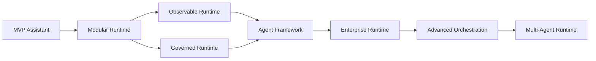

# Enterprise AI Runtime Roadmap

This roadmap describes how to evolve the current local-first assistant into an enterprise-capable modular AI runtime platform.

It assumes the current baseline already exists:

- Rasa removed from the active runtime path
- FastAPI backend in place
- PostgreSQL + pgvector in place
- Ollama-backed local inference in place
- retrieval-first RAG architecture in place
- lightweight orchestration in place

The roadmap is intentionally phased. Each phase has a clear architectural outcome, dependency ordering, and a realistic milestone boundary so the platform can keep shipping while the architecture matures.

## Engineering Workflow Guidance

This platform is now in an AI systems engineering phase, not a chatbot-building phase. That changes the recommended development tooling.

For the current state of the repo:

- Cursor is the strongest primary tool for architecture evolution, major refactors, and prompt-heavy repository changes while the design is still moving
- Claude Code is a strong secondary tool for deep orchestration, architecture generation, and system-level reasoning
- GitHub Copilot Agent Mode is the best fit for the ongoing engineering workflow once changes are grounded in repository instructions and architectural boundaries

The distinction matters.

Use GitHub Copilot here as:

```text
Copilot Agent Mode
+ repository instructions
+ architecture prompts
+ modular boundaries
```

Do not treat plain autocomplete as the development model for this repo. The platform now has enough modularity, governance, and runtime lifecycle structure that repository-aware agent workflows are materially better than isolated prompt generation.

## Tooling Recommendation By Stage

During active architecture evolution:

- primary: Cursor
- secondary: Claude Code
- supporting: GitHub Copilot Agent Mode

During ongoing engineering after architectural stabilization:

- primary: GitHub Copilot Agent Mode
- secondary: Cursor
- supporting: Claude Code

Avoid generic AI app builders, no-code wrappers, drag-and-drop orchestration tools, and generic agent builders. They are below the level of control now required by this runtime.

## Repository Instruction Milestone

As the runtime matures, repository-level AI governance becomes part of platform quality.

Add and maintain repository instructions that encode:

- architecture boundaries
- orchestration rules
- governance constraints
- dependency rules
- execution context propagation rules
- event and trace emission requirements

This should be treated as part of the platform control plane for engineering, not as optional editor metadata.

## Planning Principles

- keep the default runtime local-first and retrieval-first
- prefer modular boundaries over framework-heavy abstractions
- introduce governance before broadening tool autonomy
- make observability a platform capability, not an afterthought
- scale from single-agent deterministic flows to multi-agent coordination only when the lower layers are operationally stable
- preserve explicit ownership boundaries between API, orchestration, tools, memory, knowledge, governance, observability, and integrations

## Target End State

The target platform is a modular AI runtime with:

- multiple agents with explicit capabilities and routing metadata
- multiple enterprise tools with shared execution contracts
- modular memory systems for conversational, semantic, episodic, and policy-relevant state
- governance services for restrictions, approvals, audit, and DIF integration
- observability services for traces, metrics, logs, and health signals
- enterprise integrations isolated behind typed service and tool boundaries
- advanced orchestration that remains explainable and controllable
- optional multi-agent execution for narrowly defined collaboration patterns

## Roadmap Summary

| Phase | Objective | Estimated Duration | Depends On | Exit Outcome |
|---|---|---:|---|---|
| 1 | MVP Hardening | 2-4 weeks | Current baseline | Production-ready single-assistant MVP |
| 2 | Modular Runtime | 3-5 weeks | Phase 1 | Registry-driven runtime platform |
| 3 | Observability Foundation | 2-3 weeks | Phase 2 | Traceable, measurable runtime |
| 4 | Governance Control Plane | 2-4 weeks | Phase 2, Phase 3 | Policy-aware execution boundary |
| 5 | Agent Framework | 3-5 weeks | Phase 2, Phase 3, Phase 4 | Multi-agent-ready single-agent framework |
| 6 | Enterprise Integrations And DIF | 3-6 weeks | Phase 4, Phase 5 | Governed enterprise connectivity |
| 7 | Advanced Orchestration | 4-6 weeks | Phase 5, Phase 6 | Workflow-aware runtime coordination |
| 8 | Multi-Agent Systems | 4-8 weeks | Phase 5, Phase 6, Phase 7 | Constrained collaborative agent runtime |

These ranges assume one or two engineers working in parallel with an existing local environment. A larger team can compress some phases, but the dependency order should remain intact.

## Architecture Evolution



### Evolution Narrative

1. MVP proves the assistant is useful, stable, and worth operationalizing.
2. Modular runtime separates platform seams so growth does not turn into a monolith.
3. Observability and governance make the runtime safe to extend.
4. Agent framework adds reusable agent contracts without introducing swarm behavior.
5. Enterprise integrations and DIF connect the runtime to real operational environments.
6. Advanced orchestration adds workflow semantics, approval-aware execution, and bounded planning.
7. Multi-agent systems are added last, after the platform can already explain, trace, and govern every action.

## Phased Evolution

## Phase 1: MVP Hardening

### Goal

Turn the current local assistant into a stable, supportable, production-ready MVP for internal use.

### Why Now

The current stack already covers the core vertical slice. The immediate gap is operational quality, not more architectural complexity.

### Scope

- stabilize ingestion, retrieval, streaming chat, and tool execution
- remove remaining legacy seams that still assume a chatbot-centric structure
- standardize configuration, startup, migrations, and local operator workflows
- add baseline test coverage for chat, ingestion, retrieval, and tools
- harden secret handling and environment documentation

### Milestones

- [ ] deterministic local startup through Docker Compose and local Python workflows
- [ ] health checks for database, model runtime, and ingestion dependencies
- [ ] regression tests for retrieval and tool execution slices
- [ ] documented operator runbook for ingest, chat, and recovery flows
- [ ] curated knowledge corpus with source hygiene and checksum-based ingestion

### Exit Criteria

- a single assistant can answer from knowledge, use at least one enterprise tool, and show traceable citations
- the repo no longer depends on legacy Rasa assets for active functionality
- the platform can be demoed and recovered by another engineer without tribal knowledge

## Phase 2: Modular Runtime

### Goal

Complete the transition from application-shaped code to a registry-driven modular runtime.

### Scope

- formalize registries for agents, tools, workflows, knowledge providers, sync adapters, governance modules, and LLM providers
- finish moving business logic out of compatibility shims under `app/services/`
- establish domain-owned packages with explicit interfaces and lifecycle management
- standardize runtime container composition and shutdown behavior

### Milestones

- [ ] all major runtime components registered through catalogs rather than hardcoded construction
- [ ] compatibility shims reduced to thin adapters or removed entirely
- [ ] runtime platform surface exposes typed registries and service facades
- [ ] package boundaries documented and enforced by import discipline
- [ ] extension pattern documented for new tools, agents, integrations, and providers

### Exit Criteria

- new runtime components can be added with minimal container edits
- platform composition is discoverable, testable, and explicit
- future enterprise capabilities can land in dedicated modules instead of expanding a central service blob

## Phase 3: Observability Foundation

### Goal

Make runtime behavior measurable, diagnosable, and reviewable before autonomy increases.

### Scope

- trace context propagation across API, orchestration, retrieval, memory, governance, LLM, and tool execution
- structured logs with correlation IDs and execution metadata
- platform metrics for latency, error rates, tool usage, retrieval quality, and ingestion throughput
- health and readiness signals for core services and background flows
- telemetry sink abstraction for future OTEL or vendor exporters

### Milestones

- [ ] end-to-end request traces across chat, retrieval, and tool paths
- [ ] metrics for latency, success rate, tool failures, and ingestion results
- [ ] dashboards or documented queries for top operational signals
- [ ] alertable failure categories for database, model runtime, ingestion, and tool execution
- [ ] trace and log correlation included in support runbooks

### Exit Criteria

- operators can explain what happened in a failed request without reproducing it locally
- every governed execution path has a traceable runtime record

## Phase 4: Governance Control Plane

### Goal

Introduce execution controls that scale with tool breadth, data sensitivity, and enterprise scrutiny.

### Scope

- policy engine for allow, deny, and approval-required outcomes
- tool restrictions by capability, environment, user role, and request type
- approval flow abstraction for human-in-the-loop actions
- audit sink for decision trails and policy reasoning
- DIF adapter seam for enterprise governance interoperability

### Milestones

- [ ] policy modules evaluate requests before tool execution
- [ ] approval-required actions are blocked until approved
- [ ] audit records capture trace ID, actor context, tool context, outcome, and rationale
- [ ] DIF adapter interface defined and exercised with a no-op or stub integration
- [ ] governance defaults documented per environment: local, staging, production

### Exit Criteria

- the runtime can safely expose more than read-only tools without hidden risk escalation
- governance is a reusable control plane, not one-off checks inside tools

## Phase 5: Agent Framework

### Goal

Add reusable agent contracts, capabilities, and routing while keeping single-turn execution explicit.

### Scope

- define `BaseAgent` capabilities, metadata, and invocation contracts
- support multiple specialized agents such as knowledge, delivery, incident, or build agents
- route requests by deterministic heuristics first, with model-assisted fallback only where needed
- add agent-specific prompt, policy, and tool restrictions
- separate agent identity from orchestration logic

### Milestones

- [ ] at least two specialized agents wired through the agent registry
- [ ] agent routing decisions recorded in trace and audit metadata
- [ ] agent-specific tool and governance restrictions enforced
- [ ] agent contract stable enough for plugin-style additions
- [ ] evaluation harness for agent selection and outcome quality

### Exit Criteria

- the platform supports multiple agents without introducing recursive agent loops
- each agent has clear ownership, capabilities, and allowed execution boundaries

## Phase 6: Enterprise Integrations And DIF

### Goal

Expand beyond the initial enterprise tool surface while preserving typed contracts and governance enforcement.

### Scope

- formalize integration clients for systems such as CI/CD, ticketing, CMDB, incident management, and deployment platforms
- standardize integration auth, retries, timeouts, and failure semantics
- expose integrations as tools, sync adapters, or knowledge loaders as appropriate
- deepen DIF interoperability for policy and workflow exchange where required

### Milestones

- [ ] integration template for clients, tools, and tests
- [ ] at least two new enterprise integrations added through the shared framework
- [ ] auth and secret handling standardized per integration class
- [ ] DIF boundary documented with supported request and policy flows
- [ ] integration-specific failure handling visible in telemetry and audit data

### Exit Criteria

- new enterprise systems can be added without custom orchestration branches
- DIF-related logic stays isolated from core business flows

## Phase 7: Advanced Orchestration

### Goal

Move from single-turn decisioning to bounded workflow-aware execution.

### Scope

- workflow registry and execution models for repeatable multi-step operations
- planner interfaces for explicit task decomposition where deterministic flows are insufficient
- checkpointed execution state, resumability, and partial failure handling
- governance-aware orchestration that can require approval between steps
- memory-aware orchestration using conversational, semantic, and episodic signals

### Milestones

- [ ] workflow definitions registered independently from agents and tools
- [ ] resumable execution state persisted for long-running tasks
- [ ] planner outputs constrained by policy and workflow schema
- [ ] partial failure and retry semantics standardized
- [ ] operator-visible execution timeline for multi-step requests

### Exit Criteria

- the runtime can execute bounded multi-step tasks without becoming opaque or autonomous by default
- orchestration remains observable, governable, and resumable

## Phase 8: Multi-Agent Systems

### Goal

Introduce narrow, purposeful agent collaboration only after the runtime is already modular, observable, and governed.

### Scope

- coordinator pattern for task delegation across specialized agents
- message contracts and shared state boundaries for agent collaboration
- budget controls for turns, time, and tool invocations
- loop prevention, deadlock detection, and escalation to human review
- agent-level evaluation and replay for collaborative scenarios

### Milestones

- [ ] coordinator workflow delegates to specialized agents through explicit contracts
- [ ] collaboration budget controls enforced by governance and orchestration layers
- [ ] replay and evaluation tooling covers inter-agent handoffs
- [ ] unsafe or low-confidence collaboration paths degrade to human review
- [ ] at least one high-value collaborative workflow validated end to end

### Exit Criteria

- multi-agent execution improves a real workflow that could not be handled cleanly by a single agent or workflow
- collaboration remains bounded, auditable, and operationally supportable

## Dependency Ordering

The recommended sequence is strict in a few places:

1. complete MVP hardening before broad architectural expansion
2. complete modular runtime before scaling the number of components
3. complete observability before increasing autonomy or orchestration depth
4. complete governance before enabling broader enterprise write actions
5. complete agent framework before advanced orchestration and multi-agent collaboration
6. complete enterprise integration patterns before adding many enterprise systems
7. complete advanced orchestration before enabling collaborative agents on long-running tasks

The main reason is operational safety. Tool breadth, policy depth, and agent coordination all multiply failure modes unless the runtime already has clear seams, traces, and control points.

## Milestone Checklist

### Platform Foundation

- [ ] platform startup and recovery are deterministic
- [ ] runtime services expose stable interfaces and registries
- [ ] compatibility shims no longer own business logic

### Knowledge And Memory

- [ ] ingestion supports curated local and future remote sources
- [ ] retrieval remains citation-backed and traceable
- [ ] semantic, session, and episodic memory systems are modular and observable

### Governance And Safety

- [ ] policy evaluation happens before execution
- [ ] approvals, audits, and restriction sets are environment-aware
- [ ] DIF integration is isolated behind an adapter boundary

### Operations And Scale

- [ ] traces, metrics, and logs describe every critical execution path
- [ ] workflows support retries, checkpoints, and resumability
- [ ] enterprise integrations follow shared auth, timeout, and testing contracts

### Advanced Runtime

- [ ] specialized agents have clear capabilities and restrictions
- [ ] multi-agent collaboration is bounded by explicit budgets and policy
- [ ] evaluation harnesses exist for routing, tools, workflows, and collaboration

## Architecture Maturity Model

| Level | Name | Architecture Characteristics | Operational Characteristics |
|---|---|---|---|
| L1 | Functional MVP | Single assistant, RAG, a few tools, local runtime | Manual operations, basic tests, limited tracing |
| L2 | Modular Platform | Registry-driven runtime, domain-owned packages, service facades | Repeatable composition, clearer ownership, extension seams |
| L3 | Observable Platform | Traceable execution, runtime metrics, structured logs, health signals | Supportable incidents, measurable latency and failure patterns |
| L4 | Governed Platform | Policy engine, approvals, audits, restriction sets, DIF seam | Safe expansion of tools and write operations |
| L5 | Agent Runtime | Multiple agents, agent routing, agent-specific policies and evaluation | Managed specialization without swarm complexity |
| L6 | Orchestrated Runtime | Workflow engine, checkpointing, bounded planning, resumable execution | Reliable multi-step task handling with operator oversight |
| L7 | Collaborative Runtime | Multi-agent coordination, collaboration budgets, replay and evaluation | Enterprise-scale collaboration with strong controls |

### Recommended Target By Horizon

- near term: reach `L3` and selectively `L4`
- mid term: reach `L5`
- longer term: reach `L6`
- only adopt `L7` for workflows that prove measurable value over simpler orchestration

## Governance Maturity Model

| Level | Governance State | What Exists | What Is Still Missing |
|---|---|---|---|
| G1 | Basic Restrictions | static allowlists, environment flags, simple blocks | approvals, audits, policy composition |
| G2 | Policy-Aware Runtime | modular policies, deny and approval-required outcomes | richer actor context, standardized decision telemetry |
| G3 | Auditable Runtime | audit sink, trace-linked decisions, environment defaults | enterprise interoperability, strong review workflows |
| G4 | Enterprise Governance | approval workflows, role-aware controls, DIF adapters | cross-system policy exchange and evidence pipelines |
| G5 | Adaptive Governance | policy tuning from telemetry and evaluations under strict review | advanced automation and compliance evidence at scale |

The practical target for this project is `G4`. `G5` should only be pursued when audit quality, policy review, and evaluation discipline are already mature.

## Scalability Strategy

### Runtime Scalability

- keep the request path stateless where possible so API workers scale horizontally
- isolate long-running workflows from the synchronous chat path
- preserve explicit service facades so components can later move to separate processes if needed

### Data Scalability

- keep PostgreSQL + pgvector as the primary system until workload shape proves it insufficient
- partition ingestion and source-management concerns from retrieval-serving concerns
- add source-level versioning, incremental sync, and backfill workflows before chasing larger infrastructure changes

### Tool And Integration Scalability

- standardize tool execution contracts, retries, timeouts, idempotency, and audit metadata
- keep each integration isolated behind its own service client and tool layer
- avoid direct orchestration knowledge of third-party APIs

### Agent Scalability

- scale by specialization first, not by increasing agent count indiscriminately
- enforce capability, budget, and governance metadata on every agent
- treat collaborative agents as an optimization for a few workflows, not the default execution model

### Organizational Scalability

- maintain extension guides and templates for new runtime modules
- define ownership boundaries for knowledge, governance, integrations, orchestration, and observability
- require architecture review for new cross-cutting platform seams

## Risks And Mitigations

| Risk | Why It Matters | Mitigation |
|---|---|---|
| Overengineering too early | The runtime can become harder to ship and debug than the user problem warrants | keep each phase gated by real operational pain or product need |
| Weak platform boundaries | New capabilities collapse back into monolithic services | enforce registries, interfaces, and domain-owned packages |
| Governance added too late | Tool and agent scope grows faster than control coverage | make governance a prerequisite for broad enterprise write actions |
| Observability gaps | Multi-step failures become impossible to explain | complete trace, metric, and audit coverage before advanced orchestration |
| Integration sprawl | Each new enterprise system introduces bespoke patterns | require shared client and tool templates |
| Memory complexity | Unbounded memory behavior can degrade relevance and trust | isolate memory types, retention policy, and retrieval scoring |
| Multi-agent instability | Coordination loops and cost blowups can erase platform reliability | add budgets, coordinator-only collaboration, and replay-based evaluation |
| DIF coupling | Enterprise governance interoperability can leak into core runtime logic | keep DIF behind adapters and translated contracts |

## Implementation Priorities

### Priority 1: Finish The Platform Spine

1. harden MVP reliability, tests, and operator workflows
2. complete modular runtime composition and remove remaining compatibility ownership
3. finish observability coverage across all critical paths

### Priority 2: Make Expansion Safe

1. complete policy evaluation, approvals, audit sinks, and governance defaults
2. define the stable agent contract and routing evaluation path
3. standardize enterprise integration client and tool patterns

### Priority 3: Add Higher-Order Coordination

1. introduce workflow orchestration with checkpointing and resumability
2. connect governed enterprise integrations to workflow execution
3. add multi-agent collaboration only for proven high-value cases

### Defer Until Justified

- generalized autonomous agent swarms
- unconstrained recursive planning loops
- splitting the platform into many deployable services before the runtime boundaries are operationally mature
- replacing PostgreSQL + pgvector before retrieval scale or operational evidence demands it

## Recommended Near-Term Sequencing

For the next three milestones, the highest-value path is:

1. complete MVP hardening and close the remaining operational gaps
2. finish the modular runtime surface and remove residual service-layer duplication
3. drive observability and governance to the point where new agents and enterprise integrations can be added safely

That path raises the platform from a working assistant to an extensible runtime without forcing premature multi-agent complexity.