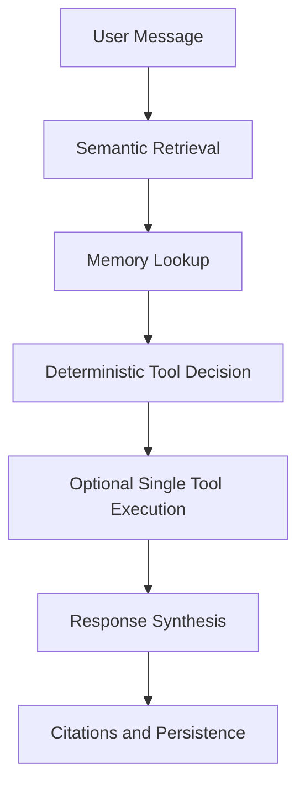

# Lightweight Orchestration

This assistant uses a single-turn orchestration flow designed for local-first enterprise use.

## Design Principles

- retrieval-first by default
- optional tool execution, never autonomous loops
- memory-aware responses using recent turns and episodic memory
- deterministic heuristics for tool selection where possible
- explicit tracing and structured logging for each turn

## Flow

## Components

- `RetrieverService`: fetches top semantic matches and source citations.
- `MemoryService`: loads recent conversation messages and semantically relevant `memory_entries`.
- `ToolExecutionService`: validates, traces, times out, and executes exactly one safe tool call when needed.
- `OrchestrationService`: combines retrieval, memory, and optional tool output into the final prompt.
- `ChatService`: thin facade used by the FastAPI route.

## Tool Decision Rules

The orchestrator does not use an autonomous planner.

- Jenkins tool: chosen only when the user explicitly asks for Jenkins job listing or job details and retrieval evidence is thin.
- API tool: chosen only when the user explicitly asks to call or query an allowlisted integration and includes a relative path.
- No tool: default path for explanatory, advisory, or document-grounded questions.

This keeps the system debuggable and avoids hidden recursive behavior.

## Memory Strategy

- Recent turns are always included up to the configured conversation window.
- User messages are stored as episodic memory entries with embeddings.
- Future turns retrieve the most relevant episodic memories semantically.
- Explicitly preference-like messages receive higher importance.

## Example Turns

### Retrieval-only

User: `How do Jenkins pipelines work in this repo?`

- retrieval finds ingested docs
- no tool is invoked
- final answer cites retrieved document chunks

### Retrieval + Jenkins Tool

User: `List Jenkins jobs`

- retrieval runs first
- retrieval looks thin for live-state data
- orchestrator invokes `jenkins` with `{"action": "list_jobs"}`
- final answer combines current Jenkins output with any retrieved context

### Retrieval + API Tool

User: `Call api integration jsonplaceholder /posts`

- retrieval runs first
- orchestrator extracts integration name and relative path
- orchestrator invokes `api` with the allowlisted integration config
- final answer summarizes the API result without recursive follow-up calls

## Extension Points

- add new tools through `app/tools/`
- extend deterministic decision rules in `OrchestrationService`
- replace heuristic selection with a small policy layer later if needed
- keep one-turn orchestration as the default even if future specialized agents are added