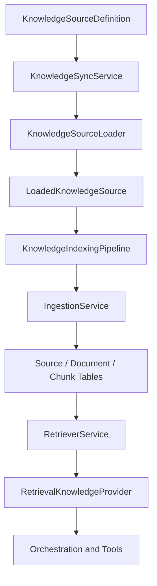
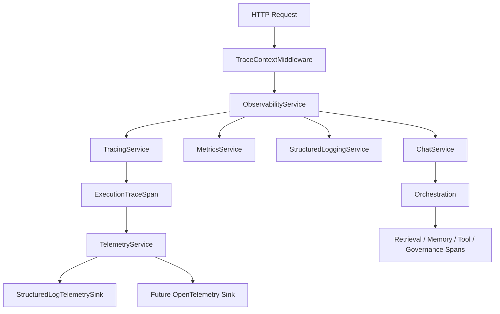
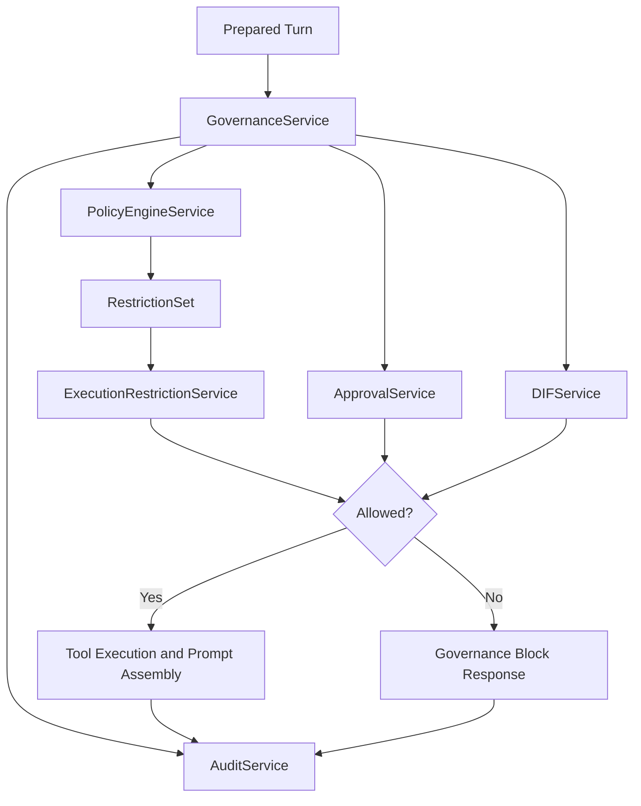
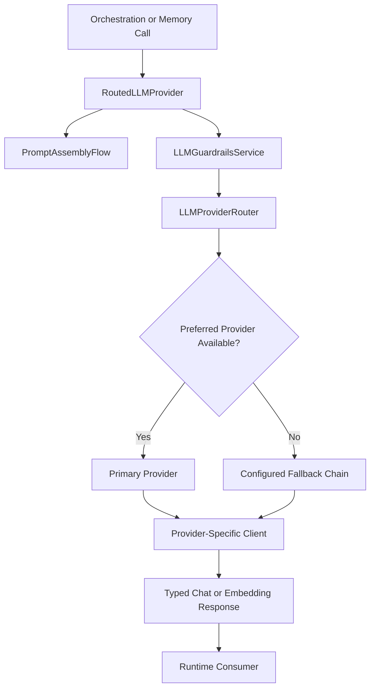
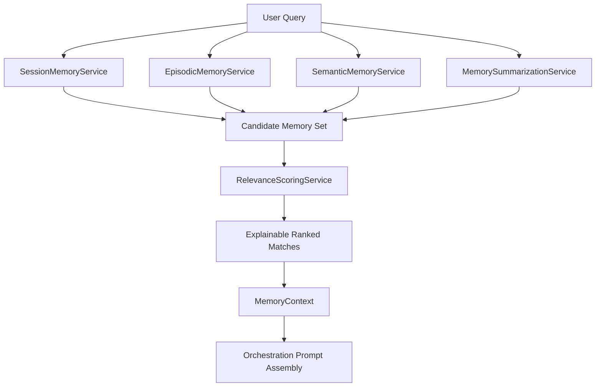
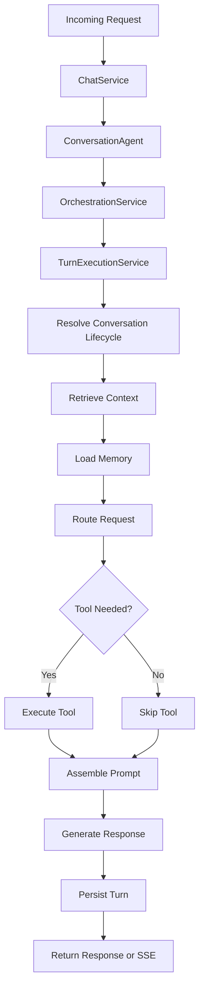
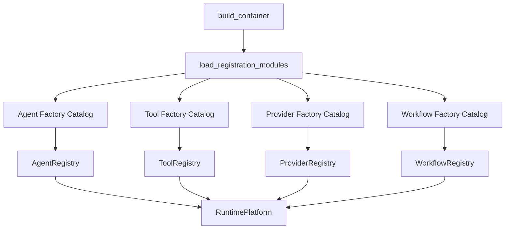

# Modular AI Runtime Platform

This repository is no longer modeled as a single chatbot backend. The runtime now follows a platform shape: API surface, orchestration engine, agent registry, tool registry, governance registry, workflow registry, retrieval, memory, and integration modules remain independently evolvable while preserving the current FastAPI and pgvector behavior.

## Target Folder Structure

```text
app/
├── api/
├── agents/
├── core/
├── governance/
│   ├── approvals/
│   ├── audits/
│   ├── dif/
│   ├── policies/
│   ├── restrictions/
│   ├── base.py
│   ├── defaults.py
│   ├── registrations.py
│   ├── registry.py
│   └── service.py
├── integrations/
├── knowledge/
│   ├── indexing/
│   ├── loaders/
│   ├── sources/
│   ├── sync/
│   ├── base.py
│   ├── registrations.py
│   ├── registry.py
│   ├── retrieval.py
│   └── service.py
├── llm/
│   ├── guardrails/
│   ├── prompts/
│   ├── providers/
│   │   ├── anthropic/
│   │   ├── azure/
│   │   ├── ollama/
│   │   └── openai/
│   ├── routing/
│   ├── base.py
│   ├── models.py
│   ├── provider.py
│   ├── registrations.py
│   └── registry.py
├── memory/
│   ├── episodic/
│   ├── relevance/
│   ├── semantic/
│   ├── session/
│   ├── summarization/
│   ├── interfaces.py
│   ├── models.py
│   └── service.py
├── observability/
│   ├── logging/
│   ├── metrics/
│   ├── telemetry/
│   ├── tracing/
│   ├── health.py
│   └── service.py
├── orchestration/
│   ├── execution/
│   ├── lifecycle/
│   ├── planners/
│   ├── routing/
│   ├── runtime/
│   ├── state/
│   └── service.py
├── rag/
├── shared/
├── tools/
└── workflows/
```

## Orchestration Package

The orchestration runtime is intentionally lightweight and explicit.

- `service.py`: public orchestration facade used by agents and the runtime container.
- `execution/`: executes a single turn end to end with no recursive control loop.
- `routing/`: deterministic request routing and optional tool selection.
- `planners/`: prompt assembly logic.
- `state/`: runtime state and turn models for observability and debugging.
- `lifecycle/`: conversation resolution, persistence, commit, and SSE formatting.
- `runtime/`: runtime container surface and shutdown lifecycle.

This keeps the execution flow debuggable because each responsibility is a separate service with direct dependencies instead of hidden orchestration magic.

## Dependency Boundaries

- `api` depends on `core`, `models`, and runtime-facing service entrypoints only.
- `orchestration` depends on `llm`, `memory`, `rag`, `tools`, and shared contracts.
- `agents` depend on `orchestration` and agent registry contracts, never directly on tool implementations.
- `tools` depend on integrations or retrieval providers, never on agent code.
- `governance` depends on shared contracts and can be inserted ahead of agent execution.
- `integrations` own external system clients such as Jenkins or allowlisted APIs.
- `observability` owns health, structured logging, tracing, metrics, and telemetry modules.
- `knowledge` abstracts retrieval-capable knowledge providers independently from agents.

## Knowledge Architecture

The runtime knowledge layer is now a modular knowledge-management boundary instead of only a retrieval wrapper.

- `sources/`: source definitions, version metadata, and ingestion result models.
- `loaders/`: source-specific loaders for markdown, yaml, txt, pdf, plus future placeholders for Git repositories, Confluence, and SharePoint.
- `indexing/`: indexing pipeline that converts loaded sources into ingestion jobs and updates source tracking metadata.
- `sync/`: explicit sync adapter seam for future remote knowledge synchronization.
- `retrieval.py`: retrieval-facing knowledge provider backed by the existing pgvector retriever.
- `service.py`: `KnowledgeManagementService`, the facade for source ingestion and future sync workflows.

This keeps source loading, version tracking, indexing, and retrieval integration isolated while still reusing the current RAG ingestion and retrieval infrastructure.

## Knowledge Flow



## Knowledge Guarantees

- Source metadata is tracked centrally through `Source.metadata_json`.
- Source version checksums and revisions are carried by `KnowledgeSourceDefinition` and written back to the source record.
- The indexing pipeline is loader-driven and can scale to multiple source kinds without changing orchestration.
- Retrieval integration remains deterministic because the knowledge management layer feeds the existing document and chunk tables.
- Future sync support is isolated behind adapters rather than mixed into loaders or retrieval code.

## Observability Architecture

The runtime observability layer is now explicit instead of relying on ad hoc `trace_id` fields and scattered log calls.

- `logging/`: structured logging service and correlation-aware formatter integration.
- `tracing/`: async-safe trace context, execution span model, tracing service, and FastAPI middleware.
- `metrics/`: lightweight runtime counters for request and subsystem visibility.
- `telemetry/`: sink abstraction for exporting spans and a future OpenTelemetry path.
- `service.py`: `ObservabilityService`, the facade used by runtime services to open spans, increment metrics, and emit logs.

This keeps request correlation and execution spans centralized while preserving a clean seam for future OTEL exporters.

## Observability Flow



## Observability Guarantees

- Every request gets a correlation ID and trace ID through middleware.
- Structured logs automatically include `trace_id`, `correlation_id`, and `span_id` from async-local context.
- Execution spans are emitted for agent execution, orchestration, governance, retrieval, memory, tool execution, and LLM calls.
- Metrics are kept lightweight and in-process today, but the abstraction is ready for external exporters later.
- Telemetry sinks isolate future OTEL or vendor-specific exporters from the runtime call sites.

## Governance Architecture

The runtime governance layer is now a first-class execution boundary rather than a placeholder registry.

- `policies/`: registry-backed modular policy evaluation.
- `restrictions/`: tool allowlist, blocklist, approval-required tools, agent restrictions, and message size limits.
- `approvals/`: pluggable approval flow contracts with a configurable default flow.
- `audits/`: audit record schema and sink abstraction for governance event trails.
- `dif/`: future DIF integration seam with a no-op adapter today.
- `service.py`: `GovernanceService`, which combines policy results, restrictions, approvals, DIF checks, and audit emission.

This keeps governance observable and configurable without coupling tool execution directly to any single policy implementation.

## Governance Flow



## Governance Outcomes

- Policy modules can allow, deny, or require approval.
- Restriction rules can disable tool execution, constrain which tools run, and restrict which agents are allowed.
- Approval-required requests are blocked from execution until approved by the configured flow.
- Audit records are emitted for each governance evaluation with traceable reason, outcome, tool, and policy metadata.
- DIF remains isolated behind an adapter so future enterprise controls can be added without changing orchestration code.

## Memory Architecture

The runtime memory layer is now modular instead of a single mixed service.

- `session/`: conversation-window memory for the active interaction scope.
- `episodic/`: user-turn memories stored as `memory_type="episodic"`.
- `semantic/`: stable fact-style memories stored as `memory_type="semantic"`.
- `summarization/`: LLM-driven memory condensation into `memory_type="summary"`.
- `relevance/`: explainable relevance scoring over stored memory candidates.
- `service.py`: facade used by orchestration so the runtime still sees one explicit memory boundary.

The architecture preserves PostgreSQL + pgvector by continuing to use `memory_entries.embedding` for similarity-aware scoring while keeping memory concerns isolated and explainable.

## LLM Provider Architecture

The LLM layer is now modular instead of being a single OpenAI-compatible client hidden behind one class.

- `base.py`: `BaseLLMProvider` contract plus compatibility helpers for existing call sites.
- `models.py`: typed chat, embedding, and routing payloads.
- `providers/`: isolated provider implementations for `ollama`, `openai`, `azure`, and `anthropic`.
- `routing/`: deterministic provider selection and fallback ordering.
- `guardrails/`: request normalization and input-size protection.
- `prompts/`: request assembly flow used by the routed facade.
- `provider.py`: `RoutedLLMProvider`, the runtime-facing facade that applies guardrails, routing, and fallback.

This keeps provider-specific transport logic isolated while the rest of the runtime depends only on the base provider contract.

## LLM Routing Flow



## LLM Fallback Rules

- Chat and embedding routes are selected separately.
- `LLM_DEFAULT_CHAT_PROVIDER` and `LLM_DEFAULT_EMBEDDING_PROVIDER` define the primary providers.
- `LLM_CHAT_FALLBACKS_JSON` and `LLM_EMBEDDING_FALLBACKS_JSON` provide deterministic ordered fallback chains.
- Providers that are not configured are skipped without changing the rest of the runtime.
- Route metadata is attached to each response so observability can see which provider and model served the request.

## Memory Retrieval Flow



## Memory Interfaces

- `SessionMemoryReader` in `app/memory/interfaces.py`
- `EpisodicMemoryStore` in `app/memory/interfaces.py`
- `SemanticMemoryStore` in `app/memory/interfaces.py`
- `MemorySummarizer` in `app/memory/interfaces.py`
- `MemoryRelevanceScorer` in `app/memory/interfaces.py`
- `MemoryContextBuilder` in `app/memory/interfaces.py`

These keep future cognitive-memory modules explicit and replaceable without hidden orchestration behavior.

## Memory Lifecycle

1. Orchestration requests a `MemoryContext` from `MemoryService`.
2. `SessionMemoryService` loads recent conversation messages.
3. Episodic, semantic, and summary stores return isolated candidate memories.
4. `RelevanceScoringService` scores candidates using embeddings and importance.
5. `MemoryContext` returns ranked memories plus explainable relevance matches.
6. After user input is stored, `EpisodicMemoryService` persists a new episodic memory.
7. `MemorySummarizationService` can compact longer conversations into summary memories.

## Explainable Retrieval

Each ranked memory now carries a `MemoryRelevanceExplanation` with:

- `memory_type`
- `similarity_score`
- `importance_score`
- `relevance_score`
- human-readable `reason`

This keeps memory retrieval debuggable and prepares the platform for future cognitive AI policies and trace export.

## Runtime Lifecycle

1. FastAPI creates the app and loads `Settings`.
2. `build_container()` assembles the `RuntimePlatform`.
3. The runtime wires integrations, retrieval, memory, orchestration, registries, and health services.
4. `ChatService` resolves an agent from `AgentRegistry`.
5. `ConversationAgent` delegates a turn to `OrchestrationService`.
6. `OrchestrationService` delegates to `TurnExecutionService`.
7. `TurnExecutionService` resolves conversation state, retrieval, memory, routing, tool execution, and prompt assembly.
8. `OrchestrationLifecycleService` persists messages, commits the turn, and formats SSE payloads.
9. FastAPI returns the response or streams SSE tokens.
10. On shutdown, `RuntimePlatform.aclose()` closes external integration clients.

## Execution Flow



## Orchestrator Interfaces

- `RequestRouter` in `app/orchestration/routing/interfaces.py`
- `PromptPlanner` in `app/orchestration/planners/interfaces.py`
- `TurnExecutionService` in `app/orchestration/execution/service.py`
- `OrchestrationLifecycleService` in `app/orchestration/lifecycle/service.py`
- `OrchestrationRuntimeState` in `app/orchestration/state/models.py`

These interfaces keep routing, planning, state, and execution swappable without introducing hidden control flow.

## Runtime State Model

`OrchestrationRuntimeState` records:

- `trace_id`
- `agent_name`
- `conversation_id`
- `route_name`
- `selected_tool`
- ordered `steps`

Each execution step is recorded explicitly through `ExecutionStep`. This makes request-level debugging and future trace export straightforward without adding an autonomous planning layer.

## Registry Architecture

- `NamedRegistry` in `app/shared/registry.py` is the common base.
- `ToolRegistry` stores executable tools.
- `AgentRegistry` stores selectable agents.
- `ProviderRegistry` stores LLM and future runtime providers.
- `GovernanceRegistry` stores policy modules.
- `WorkflowRegistry` stores workflow definitions.
- `KnowledgeRegistry` stores knowledge providers.

This keeps discovery, replacement, and future enterprise extensions consistent across modules.

Each registry now provides:

- typed registration
- strict duplicate validation
- metadata descriptors
- capability discovery
- async lifecycle close through `aclose()`
- observable registry entries through `RegistryEntry`

## Registration And Discovery

The runtime now uses decorator-backed registration catalogs rather than hardcoded per-component construction in the container.

- `FactoryCatalog` in `app/shared/registration.py` stores typed factory registrations.
- `register_factory(...)` decorates registration functions.
- `load_registration_modules()` in `app/shared/discovery.py` imports the default registration modules at startup.
- builder functions construct the live registries from discovered factories.

Current registration modules:

- `app/agents/registrations.py`
- `app/governance/registrations.py`
- `app/knowledge/registrations.py`
- `app/tools/registrations.py`
- `app/llm/registrations.py`
- `app/workflows/registrations.py`

This keeps the runtime open for future plugin packages while remaining easy to debug.

## Discovery Flow



## Registry Interfaces

Registry contracts and primitives:

- `NamedRegistry` in `app/shared/registry.py`
- `ComponentDescriptor` in `app/shared/registry.py`
- `RegistryEntry` in `app/shared/registry.py`
- `FactoryCatalog` in `app/shared/registration.py`
- `register_factory` in `app/shared/registration.py`

These give the runtime a consistent discovery and metadata model without hidden registration behavior.

## Interfaces

Core interfaces introduced in code:

- `BaseAgent` in `app/agents/base.py`
- `BaseGovernanceModule` in `app/governance/base.py`
- `BaseApprovalFlow` in `app/governance/approvals/base.py`
- `BaseAuditSink` in `app/governance/audits/base.py`
- `BaseDIFAdapter` in `app/governance/dif/base.py`
- `BaseTelemetrySink` in `app/observability/telemetry/base.py`
- `BaseWorkflow` in `app/workflows/base.py`
- `BaseKnowledgeProvider` in `app/knowledge/base.py`
- `BaseKnowledgeSourceLoader` in `app/knowledge/loaders/base.py`
- `BaseKnowledgeSyncAdapter` in `app/knowledge/sync/base.py`
- `NamedRegistry` in `app/shared/registry.py`

These are the stable seams for future multi-agent orchestration, governance enforcement, DIF-style policy layers, and advanced memory systems.

## Migration Plan

1. Move owning implementations into domain packages (`llm`, `memory`, `integrations`, `orchestration`, `observability`, `agents`).
2. Keep `app/services/*` as compatibility shims during the transition.
3. Update container wiring to instantiate registries and a runtime container.
4. Add `agent_name` routing to the chat request without breaking current API callers.
5. Migrate future logic out of compatibility shims incrementally until the old `services` package can be removed.
6. Introduce governance evaluation hooks before agent execution.
7. Add workflow executors and persistent runtime metadata when enterprise orchestration expands.

## Updated Imports

Examples of the new import surface:

```python
from app.llm.registry import ProviderRegistry
from app.llm.base import BaseLLMProvider
from app.llm.provider import RoutedLLMProvider
from app.governance.service import GovernanceService
from app.knowledge.service import KnowledgeManagementService
from app.memory.service import MemoryService
from app.observability.service import ObservabilityService
from app.orchestration.service import OrchestrationService
from app.agents.registry import AgentRegistry
from app.integrations.jenkins.service import JenkinsService
from app.observability.health import HealthService
```

Compatibility imports still work during the migration:

```python
from app.services.orchestration_service import OrchestrationService
from app.services.memory_service import MemoryService
```

## Code Examples

Construct the orchestrator facade:

```python
orchestration_service = OrchestrationService(
    settings=settings,
    llm_provider=llm_provider,
    retriever_service=retriever_service,
    memory_service=memory_service,
    tool_execution_service=tool_execution_service,
    governance_service=governance_service,
    observability_service=observability_service,
)
```

Register a provider factory:

```python
PROVIDER_CATALOG = FactoryCatalog[BaseLLMProvider]()


@register_factory(
    PROVIDER_CATALOG,
    name="ollama",
    capabilities=("chat", "embeddings", "streaming"),
    metadata={"kind": "provider", "provider_type": "llm"},
)
def build_ollama_provider(*, settings: Settings) -> BaseLLMProvider:
    return OllamaProvider(settings)
```

Register a tool factory:

```python
TOOL_CATALOG = FactoryCatalog[Tool]()


@register_factory(TOOL_CATALOG, name="tickets", capabilities=("tickets", "integration"))
def build_ticket_tool(*, api_service: ApiService) -> Tool:
    return TicketTool(api_service)
```

Register a governance policy factory:

```python
GOVERNANCE_CATALOG = FactoryCatalog[BaseGovernanceModule]()


@register_factory(
    GOVERNANCE_CATALOG,
    name="configured-restrictions",
    capabilities=("restrictions", "tool-governance"),
    metadata={"kind": "governance", "module_type": "policy"},
)
def build_configured_restrictions_policy(*, settings: Settings) -> BaseGovernanceModule:
    return ConfiguredRestrictionPolicy.from_settings(settings)
```

Register a knowledge loader factory:

```python
KNOWLEDGE_LOADER_CATALOG = FactoryCatalog[BaseKnowledgeSourceLoader]()


@register_factory(
    KNOWLEDGE_LOADER_CATALOG,
    name="markdown-loader",
    capabilities=("markdown",),
    metadata={"kind": "knowledge-loader"},
)
def build_markdown_loader(*, settings: Settings) -> BaseKnowledgeSourceLoader:
    return MarkdownKnowledgeLoader()
```

Create a custom router:

```python
from app.orchestration.routing.interfaces import RequestRouter
from app.orchestration.state.models import ToolPlan


class TicketRouter(RequestRouter):
    def route(self, user_message: str, retrieval: RetrievalResult) -> ToolPlan | None:
        if "ticket" in user_message.lower():
            return ToolPlan(name="api", arguments={"integration": "tickets", "method": "GET", "path": "/issues"})
        return None
```

Inspect runtime state during execution:

```python
turn = await execution_service.prepare_turn(session, request)
for step in turn.runtime_state.steps:
    print(step.name, step.metadata)
```

Discover runtime capabilities:

```python
for entry in runtime.tool_registry.discover(capability="retrieval"):
    print(entry.descriptor.name, entry.descriptor.capabilities)

for entry in runtime.provider_registry.entries():
    print(entry.descriptor.name, entry.descriptor.capabilities)

print(runtime.llm_provider.provider_name)
print(runtime.llm_provider.chat_model)
print(runtime.llm_provider.metadata())
```

Inspect governance decisions:

```python
decision = await runtime.governance_service.evaluate(
    GovernanceContext(
        trace_id="trace-123",
        agent_name="conversation",
        conversation_id="conv-1",
        message="please create a Jenkins job",
        requested_tool="jenkins_create_job",
    )
)

print(decision.allowed)
print(decision.reason)
print(decision.audit_record.record_id if decision.audit_record else None)
```

Ingest a knowledge source through the management service:

```python
definition = KnowledgeSourceDefinition.create(
    source_key="ops-runbooks",
    source_type="markdown",
    uri="/workspace/runbooks",
    loader_name="markdown-loader",
    revision="2026-05-11",
)

result = await runtime.knowledge_service.ingest_source(session, definition)
print(result.source_key)
print(result.version_checksum)
```

Create an observability span:

```python
async with runtime.observability_service.trace_scope(
    root_name="http.post /api/v1/chat",
    trace_id="trace-123",
    correlation_id="req-123",
):
    async with runtime.observability_service.span("retrieval.search", conversation_id="conv-1"):
        result = await runtime.retriever_service.search(session, "how do I deploy this service?")

print(runtime.observability_service.metrics_snapshot())
```

Build memory context explicitly:

```python
memory = await memory_service.build_context(
    session,
    conversation_id=conversation_id,
    query=user_query,
)

for line in memory.explainable_retrieval():
    print(line)
```

Summarize a conversation into memory:

```python
summary_entry = await memory_service.summarize_conversation(
    session,
    conversation_id=conversation_id,
)
```

Register a new agent:

```python
from app.agents.base import BaseAgent


class RunbookAgent(BaseAgent[ChatRequest, ChatResponse]):
    name = "runbook"
    description = "Agent specialized for operational runbooks."
    capabilities = ("chat", "runbooks")

    async def run(self, session: AsyncSession, request: ChatRequest) -> ChatResponse:
        ...
```

Register a governance module:

```python
from app.governance.base import BaseGovernanceModule, GovernanceContext, GovernanceDecision


class RedactionPolicy(BaseGovernanceModule):
    name = "redaction"
    description = "Blocks unsafe prompts before execution."

    async def evaluate(self, context: GovernanceContext) -> GovernanceDecision:
        return GovernanceDecision(allowed=True)
```

Register a knowledge provider:

```python
from app.knowledge.base import BaseKnowledgeProvider


class GraphKnowledgeProvider(BaseKnowledgeProvider):
    name = "graph"
    description = "Knowledge graph provider."
    provider_type = "graph"
```