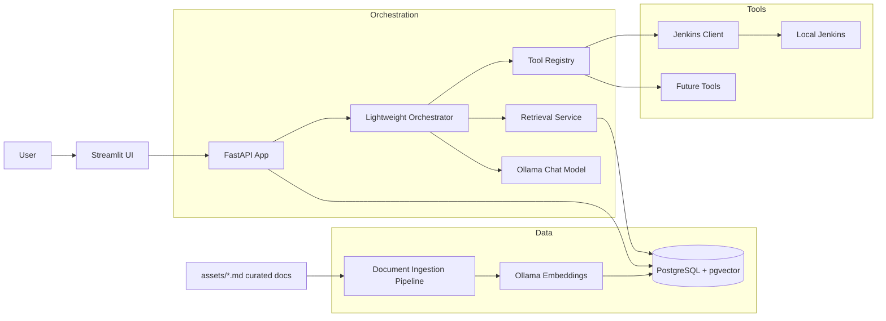
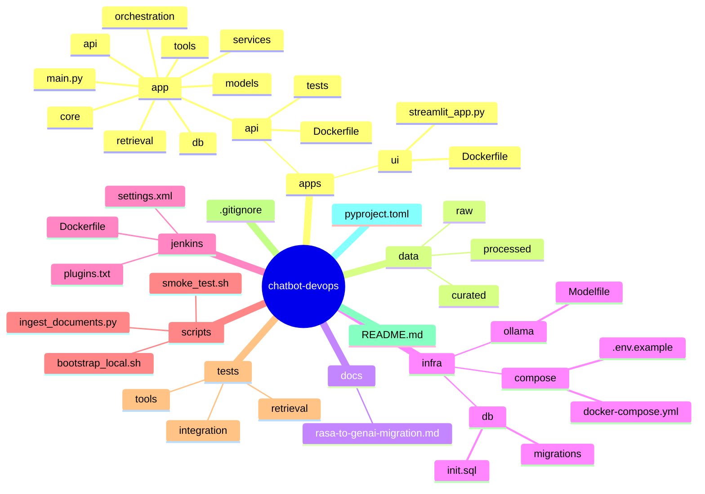

# Rasa to Local-First GenAI Migration

## Executive Summary

This repository is still centered on Rasa runtime, Rasa training artifacts, and Rasa custom actions. The only meaningful reusable backend logic is the Jenkins integration implemented inside the custom action layer. That makes the migration direction straightforward:

- drop Rasa entirely
- extract Jenkins operations into plain Python services and tool adapters
- replace intent and story routing with semantic retrieval plus explicit tool execution
- move state and knowledge storage to PostgreSQL with `pgvector`
- use Ollama for local model inference and local embeddings
- expose orchestration through FastAPI and a thin Streamlit chat UI

The fastest path is not a 1:1 rebuild. It is a reduction in architecture complexity: one API service, one database, one local model runtime, one retrieval pipeline, one tool layer, and one UI.

## Current Repository Analysis

### Rasa-Specific Components

These are framework-bound and should not be carried forward as-is.

| Component | Purpose | Assessment |
| --- | --- | --- |
| `rasa/config.yml` | Rasa NLU/Core pipeline and policy config | Remove |
| `rasa/domain.yml` | Intents, slots, responses, actions | Remove |
| `rasa/endpoints.yml` | Action server and tracker config | Remove |
| `rasa/credentials.yml` | Rasa channels and Rasa X config | Remove |
| `rasa/data/nlu.yml` | Intent/entity training examples | Remove as runtime asset; selectively repurpose as product prompt/test examples |
| `rasa/data/stories.yml` | Story-based flow logic | Remove |
| `rasa/data/rules.yml` | Rule-based conversation logic | Remove |
| `rasa/tests/test_stories.yml` | Rasa conversation tests | Remove and replace with API/tool tests |
| `rasa/markers.yml` | Tracker marker config | Remove |
| `rasa/models/` | Trained Rasa models | Remove |
| `rasa/results/` | Training and evaluation outputs | Remove after extracting any useful regression prompts |
| `rasa/actions/Dockerfile` | Rasa action server image | Remove |
| `rasa/requirements.txt` | Rasa runtime dependencies | Remove |
| `rasa/actions/requirements.txt` | Rasa SDK dependencies | Remove |

### Reusable Python Business Logic

| Component | What it does | Migration action |
| --- | --- | --- |
| `rasa/actions/actions.py` | Contains Jenkins HTTP logic and a demo game action | Extract Jenkins logic; discard Rasa wrappers |
| `rasa/actions/actions_jenkins.py` | Duplicate Jenkins list/create logic | Consolidate into one service module |

Important detail: most of the code in these files is not business logic, it is Rasa adapter code. The reusable core is only the Jenkins HTTP request behavior and payload shaping.

### API Integrations

| Integration | Location | Notes |
| --- | --- | --- |
| Jenkins REST API | `rasa/actions/actions.py` | `GET /api/json` used for job listing |
| Jenkins create job endpoint | `rasa/actions/actions.py` and `rasa/actions/actions_jenkins.py` | Create flow is incomplete and uses placeholder or weak endpoint assumptions |
| Local env configuration | `rasa/.env` | Contains live credentials and should be treated as compromised |

### Jenkins Integrations

| Asset | Purpose | Migration relevance |
| --- | --- | --- |
| `jenkins/Dockerfile` | Local Jenkins image with plugins | Keep if Jenkins remains part of local dev/test topology |
| `jenkins/plugins.txt` | Jenkins plugin manifest | Keep |
| `jenkins/settings.xml` | Maven/Jenkins settings | Keep if pipelines depend on it |
| `jenkins/keys/` | SSH material | Remove from repo history and replace with secret mounts |
| `volume/` | Jenkins persistent data mount | Keep as local-only runtime volume, not source artifact |

### Docker and Container Assets

| Asset | Current use | Migration action |
| --- | --- | --- |
| `docker-compose.yml` | Starts MongoDB and Jenkins only | Replace with a new stack centered on Postgres, Ollama, API, and Streamlit |
| `jenkins/Dockerfile` | Builds Jenkins image | Keep if Jenkins stays local |
| `rasa/actions/Dockerfile` | Builds Rasa action container | Remove |

### Training Data and Knowledge Assets

| Asset | Type | Migration action |
| --- | --- | --- |
| `rasa/data/nlu.yml` | Intent/entity examples | Do not rebuild as intents; optionally mine for test utterances |
| `rasa/data/stories.yml` | Story flows | Remove |
| `rasa/data/rules.yml` | Deterministic routing | Remove |
| `assets/*.md` | Markdown content | Review and curate as seed documents for RAG |
| `assets/*.png` | Images | Keep only if needed for docs/UI |

### Configuration Files

| File | Category | Migration action |
| --- | --- | --- |
| `README.md` | Setup docs | Rewrite for new architecture |
| `.gitignore` | Repo hygiene | Update for new services and data paths |
| `rasa/.env` | Secrets/config | Remove from repo and rotate credentials |

## Keep / Refactor / Remove / Replace

### KEEP

| Component | Why keep it |
| --- | --- |
| `jenkins/Dockerfile` | Still useful for local CI integration testing if Jenkins remains in scope |
| `jenkins/plugins.txt` | Encodes the local Jenkins feature set |
| `jenkins/settings.xml` | Likely still relevant for Maven-backed jobs |
| `assets/` markdown files | Potential RAG corpus after curation and chunking |
| `docker-compose.yml` as a concept | Keep compose-based local orchestration, but rewrite the file |

### REFACTOR

| Component | Refactor target |
| --- | --- |
| `rasa/actions/actions.py` | Split into `services/jenkins_client.py`, `tools/jenkins.py`, and optional demo utility modules |
| `rasa/actions/actions_jenkins.py` | Merge into a single typed Jenkins client/service layer |
| Jenkins credentials loading | Move to typed settings via environment-backed config |
| Repository docs | Rewrite around FastAPI, Postgres, Ollama, Streamlit |

### REMOVE

| Component | Why remove it |
| --- | --- |
| Entire `rasa/` conversational runtime surface | It exists only to support intent classification and story/rule orchestration, which is being dropped |
| Rasa models, results, and tests | No longer match the target architecture |
| MongoDB service in `docker-compose.yml` | No active code uses MongoDB as implemented here |
| RPSLS game action | Demo logic with no visible business value |

### REPLACE

| Legacy | Replacement |
| --- | --- |
| Rasa intent classification | Semantic retrieval + tool-aware LLM reasoning |
| Rasa stories/rules | Lightweight orchestration graph/state machine |
| Rasa action server | FastAPI tool execution layer |
| MongoDB placeholder/tracker idea | PostgreSQL + `pgvector` |
| Rasa response templates | Prompt templates + tool result renderers |
| Rasa REST channel | FastAPI chat endpoints + Streamlit UI |

## Technical Debt Analysis

### High Severity

1. Secret exposure

The repository contains plaintext Jenkins credentials in `rasa/.env`. This is an immediate security issue and those credentials should be rotated. The file should be removed from tracking and the history cleaned if the repo is shared.

2. Integration logic is duplicated

Jenkins list/create behavior exists in both `rasa/actions/actions.py` and `rasa/actions/actions_jenkins.py`, which increases drift risk and makes testing harder.

3. Placeholder production logic

The create-job flow uses `https://your-jenkins-url/createJob` in one path and `http://localhost:8080/createJob` in another. That suggests the feature is unfinished and not modeled against a verified Jenkins API contract.

4. Broken test surface

`rasa/tests/test_stories.yml` still references stock scaffold intents and utterances such as `utter_greet`, `utter_happy`, and `mood_unhappy`, which do not match the active domain. This means the current test suite is not trustworthy as a release gate.

### Medium Severity

1. Incomplete slot/form flow

The job creation prompt actions exist as stubs only. The legacy assistant likely never achieved a coherent multi-step creation flow.

2. Over-coupled framework and business logic

The reusable Jenkins behavior is trapped inside Rasa SDK classes, making it harder to test or reuse from another API surface.

3. Unused infrastructure

MongoDB is defined in `docker-compose.yml`, but the active repo code does not use it. This increases local complexity without delivering value.

4. Weak local-first model story

The repository claims “Generative AI” and mentions Gradio, but there is no actual LLM runtime, vector retrieval layer, or agent/tool abstraction present.

### Low Severity

1. README drift

The root documentation is mostly setup fragments and repeated Rasa commands, not a reliable system guide.

2. Asset sprawl

The `assets/` directory appears to mix useful docs with generated or exploratory content and should be curated before indexing.

## Target Architecture

### Principles

- local-first inference and retrieval
- no intent model rebuild
- no story/rule recreation
- isolate tools from orchestration
- keep future agent support optional, not mandatory for MVP
- preserve existing Jenkins integration logic through extraction, not rewrite-from-zero

### Logical Components

1. `FastAPI` application
   Handles chat requests, retrieval, tool dispatch, session state, document ingestion, and admin endpoints.

2. `PostgreSQL + pgvector`
   Stores document chunks, embeddings, chat sessions, tool audit logs, and optional conversation summaries.

3. `Ollama`
   Runs the local chat model and local embedding model.

4. Retrieval layer
   Chunks curated markdown/assets, generates embeddings locally, and retrieves relevant context with metadata filters.

5. Tool layer
   Exposes typed operations such as `list_jenkins_jobs`, `get_job_details`, `create_jenkins_job`, and later CI/CD actions.

6. Lightweight orchestrator
   Performs a small decision loop: retrieve context, decide whether a tool is needed, call tool, ground final response, persist trace.

7. `Streamlit` UI
   Thin local operator interface for chat, source citation display, tool traces, and admin refresh actions.

### Architecture Diagram

## Proposed Target Folder Structure

## Component Design Recommendations

### FastAPI

Recommended responsibilities:

- `POST /chat` for user interaction
- `POST /ingest` for document ingestion or refresh
- `GET /health` for service health
- `GET /tools` for available tool inventory
- `POST /tools/{tool_name}` for explicit tool execution in admin mode
- `GET /sessions/{id}` for conversation history and traces

Why FastAPI here:

- strong fit for typed Python service extraction
- clean async support for model and tool calls
- easy to test independently of the UI

### PostgreSQL + pgvector

Recommended tables:

- `documents`
- `document_chunks`
- `chunk_embeddings`
- `chat_sessions`
- `chat_messages`
- `tool_invocations`
- `conversation_summaries`

Recommended use:

- store chunk text and metadata for citations
- keep session and tool traces for debugging
- support future agent memory patterns without introducing another store early

### Ollama

Use two local models:

- chat model for response synthesis and tool selection
- embedding model for indexing and retrieval

Keep the model provider behind an adapter so future migration to another local runtime does not affect application code.

### Retrieval

MVP retrieval pipeline:

1. curate `assets/` into a real knowledge corpus
2. chunk markdown by heading-aware splitter
3. generate local embeddings through Ollama
4. store vectors in `pgvector`
5. retrieve top-k chunks with simple metadata filters
6. pass citations and snippets into the response prompt

### Tool Execution

Do not let the model call Jenkins directly.

Use explicit tool contracts such as:

- `list_jenkins_jobs()`
- `get_jenkins_job(name)`
- `create_jenkins_job(name, description, config_xml)`
- `trigger_jenkins_job(name, parameters)`

Each tool should:

- validate input
- log execution
- enforce timeouts
- normalize error messages
- return structured JSON to the orchestrator

### Lightweight Orchestration

MVP orchestration should stay simple.

Suggested flow:

1. classify request into `answer_from_docs`, `use_tool`, or `hybrid`
2. retrieve relevant docs if needed
3. execute one tool call at a time with structured inputs
4. synthesize grounded answer with citations and tool results
5. store conversation summary and trace

This avoids prematurely introducing a heavy agent framework while leaving the architecture ready for one later.

## Migration Roadmap

### Phase 0: Stabilize and Secure

- rotate Jenkins credentials exposed in `rasa/.env`
- remove committed secrets and move to `.env.example`
- confirm the exact Jenkins API operations the product actually needs
- freeze Rasa feature work

### Phase 1: Extract Reusable Integrations

- move Jenkins HTTP logic into a plain Python client
- write integration tests against local Jenkins
- define typed request/response models
- remove duplicated action implementations

Deliverable: reusable `jenkins_client` independent of Rasa.

### Phase 2: Build the New Runtime Skeleton

- create FastAPI service scaffold
- add PostgreSQL with `pgvector`
- add Ollama to local compose stack
- add Streamlit UI shell
- implement health checks and config management

Deliverable: runnable local-first platform without business behavior yet.

### Phase 3: Add Retrieval

- curate and clean `assets/`
- implement document ingestion and chunking
- generate embeddings locally
- store and query vectors from PostgreSQL
- add source-cited retrieval responses

Deliverable: doc-grounded assistant without Rasa.

### Phase 4: Add Tool-Oriented Chat

- register Jenkins tools
- implement simple orchestration loop
- let chat decide between retrieval, tool use, or both
- log tool traces and failures

Deliverable: working assistant that can answer from docs and interact with Jenkins.

### Phase 5: Remove Legacy Rasa Surface

- remove Rasa services, configs, and training assets from active runtime
- archive any legacy artifacts still needed for reference
- rewrite README and local setup instructions
- replace legacy tests with API, retrieval, and tool tests

Deliverable: repo fully switched to the new architecture.

## MVP Scope

The MVP should be narrower than “full agent”.

### In Scope

- local chat through Streamlit
- FastAPI backend
- Ollama chat model and embedding model
- Postgres + `pgvector`
- document ingestion for curated markdown
- semantic retrieval with citations
- Jenkins job listing
- one safe Jenkins operation beyond listing, only if verified and needed
- structured logs and basic tests

### Out of Scope for MVP

- multi-agent collaboration
- autonomous long-running planning
- rebuilding intent classifiers
- rebuilding Rasa stories or rules
- broad tool ecosystem
- production auth and multi-user RBAC

## Phased Migration Strategy

### Strategy A: Strangler Fig Migration

Recommended approach.

- keep Jenkins local environment intact
- stand up new FastAPI + Streamlit stack beside Rasa
- migrate one capability at a time
- cut traffic over once retrieval and Jenkins tooling are stable
- then delete Rasa runtime

Why this fits this repo:

- existing business logic surface is small
- duplicated and incomplete Rasa flows are not worth preserving
- local-first stack can be introduced without blocking Jenkins work

### Strategy B: Big-Bang Rewrite

Not recommended unless this is a throwaway demo repo and no continuity matters.

## Implementation Priorities

1. Extract and test Jenkins client outside Rasa.
2. Replace `docker-compose.yml` with a new local stack: `postgres`, `ollama`, `api`, `ui`, optional `jenkins`.
3. Build retrieval ingestion for curated markdown assets.
4. Implement the orchestrator for `retrieve`, `tool`, and `hybrid` paths.
5. Remove Rasa runtime and rewrite docs.

## Migration Recommendations

### What to Preserve

- Jenkins local environment assets
- any verified Jenkins API behavior
- markdown knowledge assets after curation

### What Not to Preserve

- intents
- entities
- stories
- slot logic
- response templates
- action server architecture

### What to Redesign Cleanly

- state management
- chat API contract
- testing strategy
- environment configuration
- secrets handling
- container topology

## Suggested First Sprint

### Sprint Goal

Prove the new stack can answer from docs and list Jenkins jobs locally without Rasa.

### Sprint Deliverables

- FastAPI skeleton
- Streamlit shell
- Postgres + `pgvector`
- Ollama integration
- document ingestion pipeline for `assets/`
- extracted Jenkins client with `list_jobs`
- one end-to-end happy path test

### Exit Criteria

- user can ask a question grounded in curated markdown and receive cited output
- user can ask for Jenkins jobs and receive a tool-backed answer
- no Rasa service is required for the MVP flow

## Final Recommendation

Treat this as a migration from framework-led conversation design to service-led AI composition.

The repo does not contain a deep conversational asset base worth porting. It contains a thin Rasa shell around a small Jenkins integration. That is favorable. Preserve the integration intent, not the Rasa implementation. Build a local-first FastAPI platform with `pgvector`, Ollama, retrieval, and explicit tools. Keep orchestration lightweight until real complexity appears.